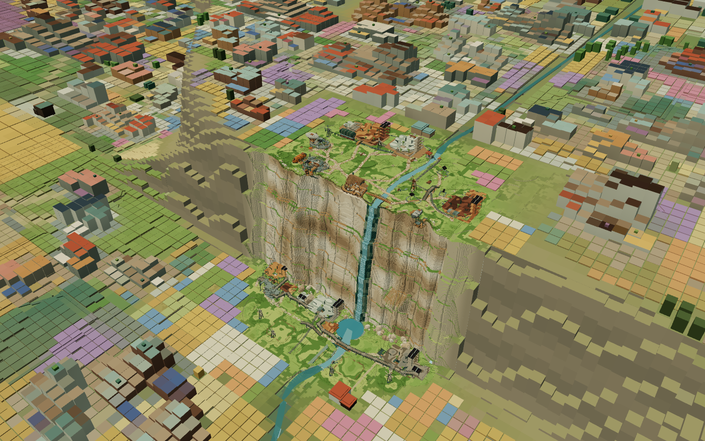
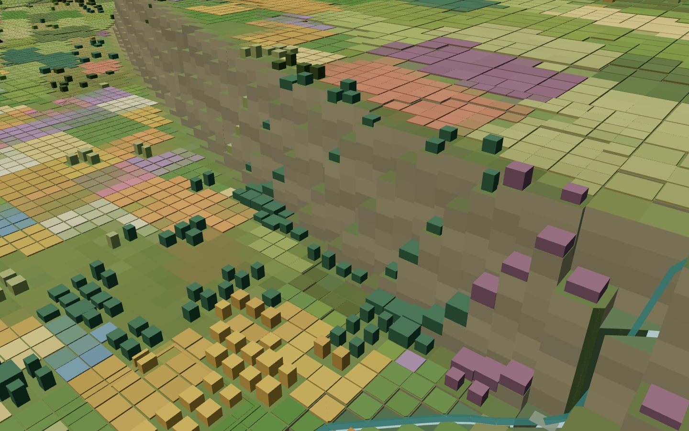

# 鹰巢河岸、种植地块与 Atheria 树林

鹰巢的上下河岸各加入一栋由两块主体组成的房屋，四段空带补入 302 块扁平种植体素。过渡草地、房屋与原有田块相接，保留溪流、小路和停留空间。

树林在原有范围内形成更厚的块面，保留细缝与草地空洞。导出模型的林内树冠覆盖率约 60%，林缘 34%，果园 40%；绿色占树冠面积约 85%。这些数字用于当前场景的美术核验。

几何与范围检查、3,117 项 HTTP 检查、普通与压缩资源的浏览器检查均通过。现有鹰巢细节、光伏、水体、原有房屋与屋顶树保留；本地 timelapse 正文未改，GitHub 上用户新增的正文提交已保留。未执行网站部署。

[下载本轮增量压缩包](../updates/archeon-river-trees-20260910.zip)：99.52 MiB，1043 个条目全部通过解压哈希校验。包内包含模型更新、生成源文件、报告及前后截图；依赖现有 Atlas 的其他资源。

旧 review 的 18 个批次已在本地集中归档，64.70 GB、118,044 个文件逐项核对一致，供用户手动删除；光伏批次保留，没有操作回收站。
