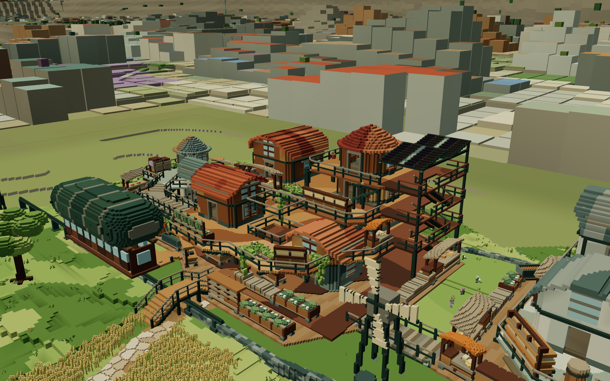
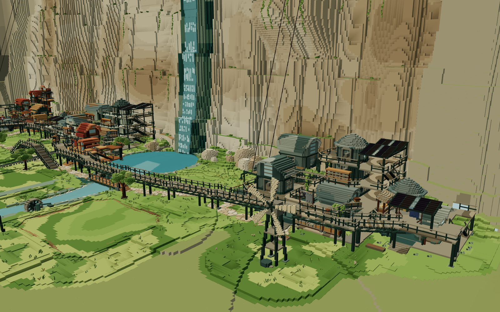

# 住宅群光伏：玻璃檐与屋面受光片

13 处固定光伏已接入房屋：五栋大屋沿上层木廊分段展开，五处小板成为露台或门廊的遮檐，东侧三栋小屋沿原屋面铺设。圆顶、高低错落的木台、小艇与既有摆设保留。

受光面改为乌紫黑与茶黑，透明采光窄片分别生成。旧高架、蓝底浅格及对应悬空电线退出活跃资源。檐柱与接线按所属住宅登记。

## 核验

- 净受光片面积约 175.9 → 274.9 平方米。
- 白昼预设下的未遮挡投影面积约 124.1 → 179.2 平方米；黄昏约 105.7 → 138.0 平方米。这是静止场景的几何比较，不是全年发电量。
- 222 项住宅通行检查通过；原行走高度数据保留，柱脚、摆设避让与实际檐下净空检查通过。
- 导入 3113 项依赖，HTTP 核查 3114 项；原始与压缩页面均加载源版本 2026-09-10T18:12:52.225Z，无页面错误或缺失资源。
- 压缩网站的 1,711 个数据包和 1,527 个其他资源校验通过，解压后的模型与正文哈希一致。9 个静态页面完整生成。
- timelapse 与英文阅读文件保持不变。本轮没有部署网站。

## 压缩更新包

[下载增量 ZIP](../updates/archeon-solar-20260910.zip) · [压缩包哈希与大小](../updates/archeon-solar-20260910.json)

ZIP 约 76.96 MB，包含 90 个文件：作者版模型增量、共享光伏生成器、网站模型增量及前后核验记录。每一项均已解压并逐字节核对 SHA-256。目录按 source、website、review 区分；保留原目录结构应用到对应工作区。回退备份保留在作者的本地工作区，ZIP 不替代完整基线。
